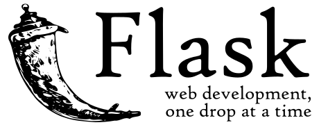

# Curso flask (Miniframework python para desarrollar páginas web)

Flask es un "micro" framework escrito en Python y concebido para facilitar el desarrollo de aplicaciones Web bajo el patrón MVC.

Los siguientes contenidos forman parte de un curso que he impartido para [OpenWebinars](https://openwebinars.net/cursos/flask/?ref=landing-cursos) en septiembre de 2017.

Puedes obtener todo el contenido del curso en el repositorio [GitHub](https://github.com/josedom24/curso_flask).
Todas las observaciones, mejoras y sugerncias son bienvenidas.

Mi nombre es Jośe Domingo Muñoz, y me puedes seguir en mí pagina web: [PLEDIN 2.0](https://www.josedomingo.org) y en twitter: [@pledin_jd](https://twitter.com/Pledin_JD).

