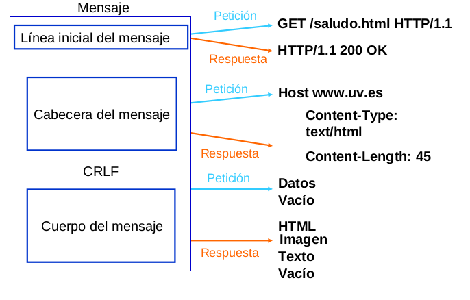

# Protocolo HTTP

## Descripción general

Protocolo de comunicaciones estándar que comunica servidores, proxys y clientes. Permite la transferencia de documentos web, sin importar cual es el cliente o cual es el servidor.

Es un protocolo basado en el esquema petición/respuesta. El cliente realiza una petición y el servido devuelve una respuesta.

El protocolo HTTP está basado en mensajes de texto plano y es un protocolo sin manejo de estados.

## Funcionamiento del protocolo

El usuario escribe una URL, indicando el protocolo, servidor y recurso que quiere obtener, el servidor procesa dicha información y devuelve un mensaje de respuesta, normalmente con el HTML de la página que se va a visualizar,...

El contenido del mensaje según sea la petición o la respuesta lo podemos ver en el siguiente esquema:

## Métodos de envío de los datos

Cuando se realiza una petición se puede utilizar uno de los siguientes métodos:

* GET: Solicita un documento al servidor. Se pueden enviar datos en la URL.
* HEAD: Similar a GET, pero sólo pide las cabeceras HTTP.
* POST: Manda datos al servidor para su procesado.Similar a GET, pero además envía datos en el cuerpo del mensaje.
* PUT: Almacena el documento enviado en el cuerpo del mensaje.
* DELETE: Elimina el documento referenciado en la URL.
* ...

<ins class="adsbygoogle"
     style="display:block; text-align:center;"
     data-ad-layout="in-article"
     data-ad-format="fluid"
     data-ad-client="ca-pub-7389130691286042"
     data-ad-slot="7512554283"></ins>

## Código de estados

Cuando el servidor devuelve una respuesta se indica un código de estado:

## Cabeceras

Tanto la petición como las respuestas tienen una serie de metainformación llamadas cabeceras, podemos indicar las más importantes:

	
* `Server`: indica el tipo de servidor HTTP empleado.
* `Age`: indica el tiempo que ha estado el objeto servido almacenado en un proxy cache (en segundos)
* `Cache-control`: lo usa el servidor para decirle al navegador que objetos cachear, durante cuanto tiempo, etc..
* `Content-Encoding`: se indica el tipo de codificación empleado en la respuesta
* `Expires`: indica una fecha y hora a partir del cual la respuesta HTTP se considera obsoleta. Usado para gestionar caché.
* `Location`: usado para especificar una nueva ubicación en casos de redirecciones.
* `Set-Cookie`: sirve para crear cookies. Las famosos cookies viajan entre el servidor y el navegador a través de estas cabeceras HTTP.

## Cookies

Las cookie son información que el navegador guarda en memoria o en el disco duro dentro de ficheros de texto, a solicitud del servidor. Incluyen datos generados por el servidor, o datos introducidos en un formulario por el usuario, enviados al servidor y reenviados por
éste al cliente.

HTTP es un protocolo sin estados (no almacena el estado de la sesión entre peticiones sucesivas), las cookies pueden usarse para asociar estado. Proporcionan una manera de conservar cierta información entre peticiones del cliente.

Ejemplos de uso:

* Guarda información de la sesión.
* Comercio electrónico.
* Carrito de la compra.
* Personalización de páginas
* Idiomas
* Seguimiento de las visitas a un Web
* Carteles publicitarios
* Almacenamiento del login y password

## Sesiones

HTTP es un protocolo sin manejo de estados. Las sesiones son fundamentales en las aplicaciones
Web. Permiten:

* Definir varios estados distintos en la aplicación.
* Colocar las solicitudes y respuestas dentro de un contexto más amplio.
* Los clientes y servidores intercambian información sobre el estado de la aplicación.

El servidor almacenará la información necesaria para llevar el seguimiento de la sesión.

* Identificador de la sesión.
* Identificador del usuario en sesión.
* Tiempo de expiración de la sesión.
* Variables asociadas a la sesión.

El mecanismo más usual para permitir las sesiones es por medio de las cookie, guardando el identificador de la sesión.