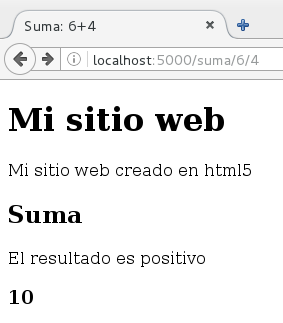
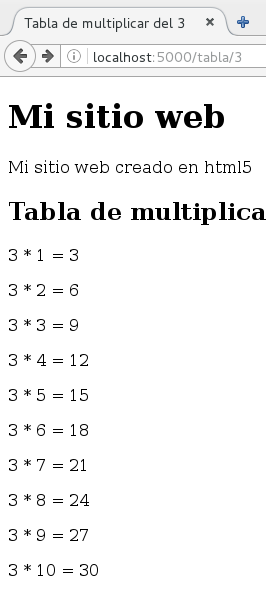
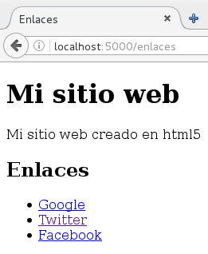

# Generando páginas HTML con Flask y Jinja2

Flask utiliza por defecto jinja2 para generar documentos HTML, para generar una plantilla utilizamos la función `render_template` que recibe como parámetro el fichero donde guardamos la plantilla y las variables que se pasan a esta.

Las plantillas las vamos a guardar en ficheros en el directorio `templates` (dentro del directorio `aplicacion`).

## Plantilla simple

Veamos un ejemplo de cómo podemos generar HTML a partir de una plantilla en Flask, el  programa será el siguiente:

	...
	@app.route('/hola/<nombre>')
	def saluda(nombre):
    	return render_template("template1.html",nombre=nombre)

La plantilla:

	<!DOCTYPE html>
	<html lang="es">
	<head>
	<title>Hola, que tal {{nombre}}</title>
	<meta charset="utf-8" />
	</head>
	 
	<body>
	    <header>
	       <h1>Mi sitio web</h1>
	       
Mi sitio web creado en html5

	    </header>
	    <h2>Vamos a saludar</h2>
	    
	      <h1>Hola {{nombre|title}}</h1>
	      
¿Cómo estás?

	    
	      
No has indicado un nombre

	    
	</body>
	</html>

Y la salida:

## Envío de varias variables a una plantilla

En este caso veremos un ejemplo donde mandamos varias variables a la plantilla:

	@app.route('/suma/<num1>/<num2>')
	def suma(num1,num2):
		try:
			resultado=int(num1)+int(num2)
		except:
			abort(404)
		return render_template("template2.html",num1=num1,num2=num2,resultado=resultado)

La plantilla:

	...
	    <h2>Suma</h2>
	    
	      
El resultado es positivo

	    
	      
El resultado es negativo

	    
	    <h3>{{resultado}}</h3>
	...

Y la salida:

## Generando páginas de error con plantillas

Como vemos en el ejemplo anterior, si los números no se pueden sumar se generara una respuesta 404, podemos también generar esta página a partir de una plantilla:

	@app.errorhandler(404)
	def page_not_found(error):
		return render_template("error.html",error="Página no encontrada..."), 404

La plantilla:

	...
	    <header>
	       <h1>{{error}}</h1>
	       
	    </header>   
	...

## Uso de for en una plantilla

En este caso vamos a mostrar la tabla de multiplicar de un número, en la plantilla vamos a generar un bucle con 10 iteraciones usando el tipo de datos `range`:

	@app.route('/tabla/<numero>')
	def tabla(numero):
		try:
			numero=int(numero)
		except:
			abort(404)
		return render_template("template3.html",num=numero)

La plantilla:

	...
	    <h2>Tabla de multiplicar</h2>
	    
	      
{{num}} * {{i}} = {{num*i}}

	    
	...

Y la salida:

## Envío de diccionario a una plantilla

En realidad vamos a mandar una lista de diccionarios, donde tenemos información para construir un enlace:

	@app.route('/enlaces')
	def enlaces():
		enlaces=[{"url":"http://www.google.es","texto":"Google"},
				{"url":"http://www.twitter.com","texto":"Twitter"},
				{"url":"http://www.facbook.com","texto":"Facebook"},
				]
		return render_template("template4.html",enlaces=enlaces)

La plantilla:

	...
	    <h2>Enlaces</h2>
		
	    <ul>
	    
	      <li><a href="{{ enlace.url }}">{{ enlace.texto }}</a></li>
	    
		</ul>
	    
	    	
No hay enlaces>

	    
	...

Y la salida:

## Código ejemplo de esta unidad

[Código](../../ejemplos/u15)
