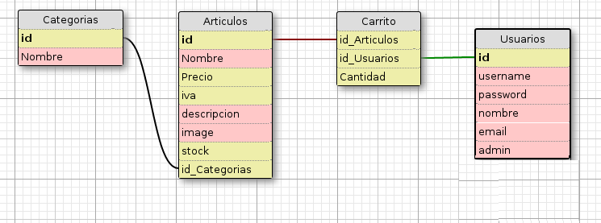

# Usando base de datos en Flask, flask-sqlalchemy

Aunque python nos ofrece diferentes módulos para conectarnos a los distintos motores de base de datos:

* mysql: [MySql-Python](https://pypi.python.org/pypi/MySQL-python), [PyMySQL](https://pypi.python.org/pypi/PyMySQL), [Mysql Conector](https://dev.mysql.com/downloads/connector/python/)
* [postgreSQL](https://wiki.postgresql.org/wiki/Python)
* [sqlite3](https://docs.python.org/2/library/sqlite3.html)

Usaremos la extensión [Flask-SQLAlchemy](http://flask-sqlalchemy.pocoo.org/2.1/) para manejar el modelo de datos de nuestra aplicación. Esta extensión provee un wrapper para el proyecto [SQLAlchemy](https://www.sqlalchemy.org/), el cual es un [Object Relational Mapper](https://es.wikipedia.org/wiki/Mapeo_objeto-relacional) o ORM.

Los ORM permiten a las aplicaciones con base de datos trabajar con objetos en vez de tablas y SQL. Las operaciones realizadas en los objetos son traducidos a comandos de base de datos transparente para el ORM. Por lo tanto se abstrae el gestor de base de datos utilizado, si cambiamos de SGBD no tendremos que cambiar nuestra aplicación. De este modo, por ejemplo, podemos estar trabajando con sqlite3 en nuestro entorno de desarrollo, y con una base de datos PostgreSQL en nuestro entorno de producción.

## Nuestra aplicación: "Mini" tienda virtual

A parir de esta unidad vamos a desarrollar una aplicación Web con todos los elementos que hemos aprendido en las unidades anteriores, las características de nuestra aplicación van a ser las siguientes:

* Vamos a crear una "mini" tienda virtual donde se van a vender artículos (en nuestro 
ejemplo serán videojuegos). Cada artículo pertenece a una categoría.
* A nuestra tienda virtual se pueden dar de alta nuestro clientes.
* Existe un usuario administrador que puede dar de alta, modificar o eliminar los artículos de la tienda.
* Cuando un usuario compra un artículo se guarda en un "carro de la compra". El carro de la compra no lo vamos a guardar en una tabla de la base de datos, vamos a utilizar cookies para guardar dicha información.
* Los usuarios pueden acceder a la tienda para realizar las compras, vamos a utilizar sesiones para similar la persistencia de la conexión.

## El modelo de base de datos

Los datos que guardamos en nuestra base de datos serán representados por una colección de clases que son referidas como modelos de base de datos. La capa ORM hará las traducciones necesarias y convertirá los objetos creados a partir de estas clases  a filas en la base de datos.

Veamos el modelo de datos que vamos a implementar:

* Categorías: Tabla para guardar las categorías de los artículo. Vamos a poder buscar artículos por categorías.
* Artículos: Tabla donde guardamos delos datos de los artículo. Cada artículo corresponde a una categoría.
* Usuarios: Tabla donde guardamos los datos de los usuarios. Un usuario puede tener el perfil de administrador.
* Carrito: Podríamos guardarlo en una tabla, pero en nuestro ejemplo vamos a usar cookies para gestionar los artículos que va comprando un usuario.

## Instalación de flask-sqlalchemy

La extensión Flask-sqlalchemy nos posibilita usar el módulo sqlalchemy en nuestra aplicación FLask. Para instalarla, en nuestro entono virtual activo:

	pip install Flask-Sqlalchemy

A continuación necesitamos configurar algunos parámetros para configurar nuestra aplicación.



## Configuración de nuestra configuración

Todos los parámetros de configuración de la aplicación que necesitemos los vamos a guardar en un nuevo fichero (`config.py`) que guardaremos en el directorio `aplicacion`, con la configuración de Flask-sqlalchemy quedaría de la siguiente manera:

	import os	

	secret_key = 'A0Zr98j/3yX R~XHH!jmN]LWX/,?RT'
	PWD = os.path.abspath(os.curdir)	

	DEBUG = True
	SQLALCHEMY_DATABASE_URI = 'sqlite:///{}/dbase.db'.format(PWD)
	SQLALCHEMY_TRACK_MODIFICATIONS = False

* `secret_key`: Ya la habíamos usado anteriormente, nos permite cifrar los tokens para el mecanismo de seguridad CSRF de los fomularios.
* `SQLALCHEMY_DATABASE_URI`: Indicamos la cadena de conexión a la base de datos. En este caso vamos a utilizar una base de datos sqlite3. Podríamos tener varias variables para configurar las conexiones de base de datos en los entornos de desarrollo, prueba y producción.
* `SQLALCHEMY_TRACK_MODIFICATIONS`: Deshabilitamos la gestión de notificaciones de sqlalchemy.

Este fichero se utilizará en el programa principal para cargar las variables de configuración:

	app.config.from_object(config)

Además en el programa principal vamos a crear un objeto que representa nuestra base de datos:

	db = SQLAlchemy(app)

El programa principal quedaría:

	from flask import Flask, render_template
	from flask_bootstrap import Bootstrap
	from flask_sqlalchemy import SQLAlchemy
	from aplicacion import config	
	

	app = Flask(__name__)
	app.config.from_object(config)
	Bootstrap(app)	
	db = SQLAlchemy(app)	

	@app.route('/')
	def inicio():
		return render_template("inicio.html")	

	@app.errorhandler(404)
	def page_not_found(error):
		return render_template("error.html",error="Página no encontrada..."), 404

## Código ejemplo de esta unidad

[Código](https://github.com/josedom24/curso_flask/tree/master/ejemplos/u21)

