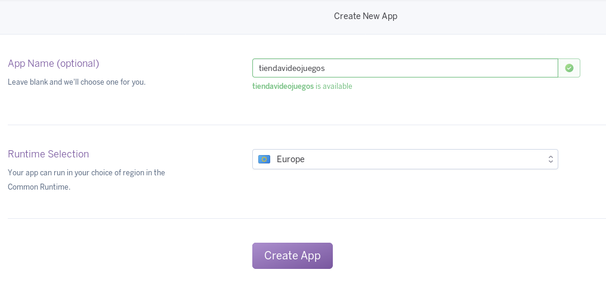
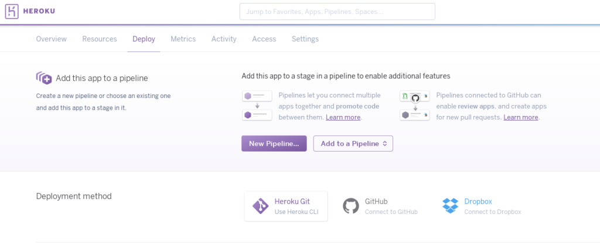
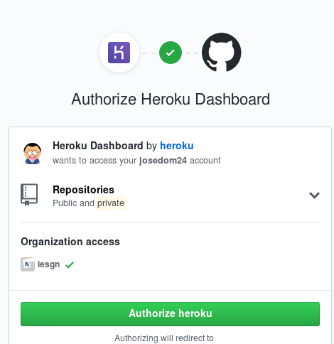
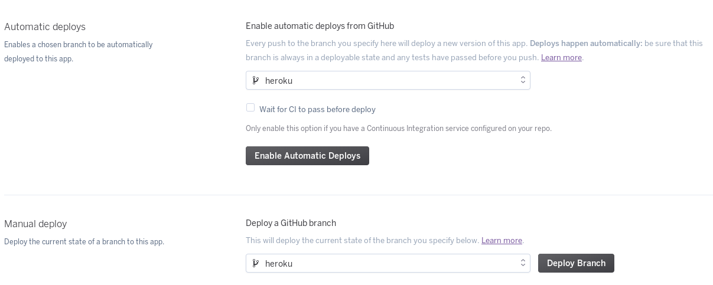
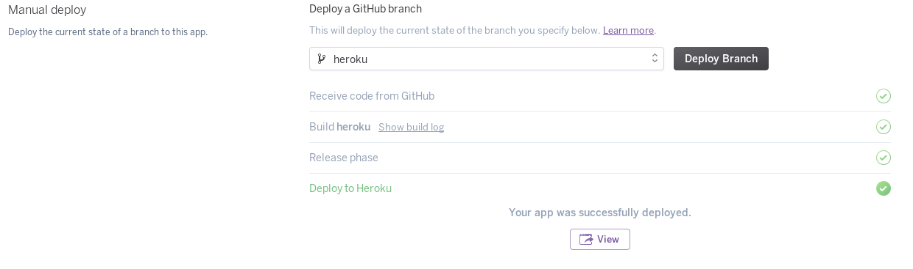
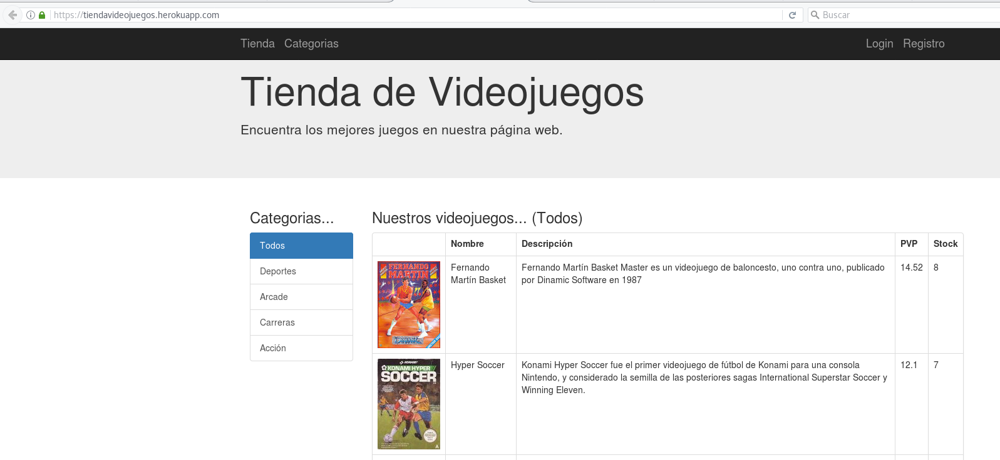
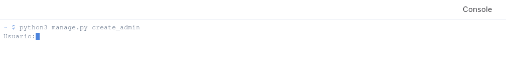

# Despliegue de aplicación flask en un PaaS Heroku

En esta unidad vamos a desplegar nuestra aplicación web desarrollada en python utilizando el framework flask utilizando sólo la aplicación web Heroku (Heroku Dashboard) (no vamos a utilizar el comando `heroku-cli`).

[Heroku](https://www.heroku.com/) es una aplicación que nos ofrece un servicio de Cloud Computing [PaaS](https://en.wikipedia.org/wiki/Platform_as_a_service) (Plataforma como servicio). Como leemos en la Wikipedia es propiedad de Salesforce.com y es una de las primeras plataformas de computación en la nube, que fue desarrollada desde junio de 2007, con el objetivo de soportar solamente el lenguaje de programación Ruby, pero posteriormente se ha extendido el soporte a Java, Node.js, Scala, Clojure y Python y PHP. La funcionalidad ofrecida por heroku esta disponible con el uso de dynos, que son una adaptación de los contenedores Linux y nos ofrecen la capacidad de computo dentro de la plataforma.

Vamos a utilizar la capa gratuita de Horoku:

* Podemos crear un dyno, que puede ejecutar un máximo de dos tipos de procesos.
* Nuestro dyno utiliza 512 Mb de RAM
* Tras 30 minutos de inactividad el dyno se para (sleep), además debe estar parado 6 horas cada 24 horas.
* Podemos utilizar una base de datos postgreSQL con no más de 10.000 registros
* Para más información: [planes ofrecido por heroku](https://www.heroku.com/pricing#dynos-table-modal)

## Preparativos previos

* Tenemos que crear una cuenta gratuita en Heroku (singup)
* En el repositorio github de nuestra aplicación hemos creado un nuevo fichero:
	* `Procfile`: En este fichero se define el proceso que va a ejecutar el dyno. Para más información: [Process Types and the Procfile](https://devcenter.heroku.com/articles/procfile)

## Creamos una nueva aplicación en heroku

Tenemos que indicar un nombre único. La URL de nuestra aplicación será: https://tiendavideojuegos.herokuapp.com

## Conectamos nuestro proyecto a GitHub

El contenido que vamos a desplegar en nuestro proyecto se va a copiar desde el repositorio donde tenemos nuestra aplicación, para ello desde la pestaña **Deploy** vamos a escoger la opción: **Connect to GitHub**.

 

A continuación desde GitHub le tenemos que dar permiso a la aplicación Heroku, para que accede a nuestros repositorios:

 

Ahora tenemos que conectar el repositorio donde tenemos nuestra aplicación:
        
 

Tenemos a nuestra disposición dos maneras de hacer los despliegues:

* Automáticos: Esta opción la podemos habilitar. Cada vez que hagamos un commit en nuestro repositorio GitHub, heroku va  a desplegar la aplicación. Tenemos que elegir la rama que se va desplegar de forma automática.
* Manual: Elegimos la rama que vamos a desplegar y pulsamos el botón **Deploy Branch**

 

Veamos un ejemplo de despliegue manual:

 

Y accedemos a la página:

 

Por último indicar que podemos ejecutar un terminal en el dyno para ejecutar cualquier instrucción. Para ello seleccionamos la opción **Run console" de la opción **More** y ejecutamos `heroku run bash`:

 
